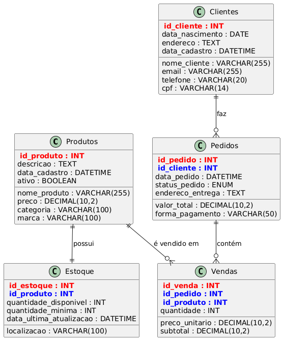

# 🛍️ DNCommerce API - RID186289_Desafio06

> **Sistema de gerenciamento de estoque e pedidos para loja online de produtos de beleza**

## 📋 Descrição do Projeto

A **DNCommerce API** é uma solução completa desenvolvida em **Node.js + Express** para gerenciamento de uma loja online de produtos de beleza. O sistema permite o cadastro de produtos, clientes, controle de estoque, criação de pedidos e registro de vendas através de uma API REST robusta e bem estruturada.

Este projeto foi desenvolvido como parte do **Desafio 06** seguindo todas as especificações e critérios de avaliação estabelecidos.

## 🎯 Funcionalidades Principais

- ✅ **CRUD completo de Produtos** (cadastro, consulta, atualização, exclusão)
- ✅ **CRUD completo de Clientes** com validações
- ✅ **Controle de Estoque** com alertas de estoque baixo
- ✅ **Sistema de Pedidos** com múltiplos itens
- ✅ **Registro de Vendas** com relatórios
- ✅ **API REST** com códigos HTTP adequados
- ✅ **Validações** de dados e regras de negócio
- ✅ **Tratamento de Erros** centralizado

## 🗄️ Diagrama do Banco de Dados



### Entidades e Relacionamentos

O sistema foi modelado com **5 entidades principais** conforme especificado:

1. **Produtos** - Catálogo de produtos de beleza
2. **Clientes** - Cadastro de clientes da loja
3. **Estoque** - Controle de quantidades disponíveis
4. **Pedidos** - Pedidos realizados pelos clientes
5. **Vendas** - Itens vendidos (relaciona pedidos com produtos)

**Relacionamentos:**
- Cliente → Pedidos (1:N)
- Produto → Estoque (1:1)
- Pedido → Vendas (1:N)
- Produto → Vendas (1:N)

## 🚀 Tecnologias Utilizadas

- **Node.js** - Runtime JavaScript
- **Express.js** - Framework web minimalista
- **MySQL** - Sistema de gerenciamento de banco de dados
- **mysql2/promise** - Driver MySQL com suporte a Promises
- **CORS** - Controle de acesso entre origens
- **Helmet** - Middlewares de segurança
- **Morgan** - Logger de requisições HTTP
- **UUID** - Geração de identificadores únicos

## ⚙️ Instalação e Configuração

### Pré-requisitos

- **Node.js** (versão 14 ou superior)
- **npm** (gerenciador de pacotes)
- **MySQL Server** (versão 5.7 ou superior)

### 1️⃣ Clone o repositório

```bash
git clone https://github.com/seu-usuario/RID186289_Desafio06.git
cd RID186289_Desafio06
```

### 2️⃣ Instale as dependências

```bash
npm install
```

### 3️⃣ Configuração do Banco de Dados

#### Criar o banco e usuário MySQL

```sql
CREATE DATABASE dncommerce;
CREATE USER 'user'@'localhost' IDENTIFIED BY 'dnpassword';
GRANT ALL PRIVILEGES ON dncommerce.* TO 'user'@'localhost';
FLUSH PRIVILEGES;
```

#### Importar estrutura e dados iniciais

```bash
mysql -u user -p dncommerce < dncommerce_mysql.sql
```

### 4️⃣ Configurar variáveis de ambiente

Copie o arquivo `.env.example` para `.env` e configure suas credenciais:

```bash
cp .env.example .env
```

Edite o arquivo `.env`:

```env
DB_HOST=localhost
DB_USER=user
DB_PASSWORD=dnpassword
DB_NAME=dncommerce
PORT=3030
```

### 5️⃣ Iniciar o servidor

```bash
npm start
```

O servidor estará disponível em: **http://localhost:3030**


## Estrutura do Banco de Dados

### Entidades

#### Produtos
- `id_produto` (PK) - Identificador único
- `nome_produto` - Nome do produto
- `descricao` - Descrição detalhada
- `preco` - Preço unitário
- `categoria` - Categoria (maquiagem, skincare, perfumes)
- `marca` - Marca do produto
- `data_cadastro` - Data de cadastro
- `ativo` - Status do produto

#### Clientes
- `id_cliente` (PK) - Identificador único
- `nome_cliente` - Nome completo
- `email` - Email (único)
- `telefone` - Telefone de contato
- `cpf` - CPF (único)
- `data_nascimento` - Data de nascimento
- `endereco` - Endereço completo
- `data_cadastro` - Data de cadastro

#### Estoque
- `id_estoque` (PK) - Identificador único
- `id_produto` (FK) - Referência ao produto
- `quantidade_disponivel` - Quantidade em estoque
- `quantidade_minima` - Estoque mínimo
- `localizacao` - Localização física
- `data_ultima_atualizacao` - Última atualização

#### Pedidos
- `id_pedido` (PK) - Identificador único
- `id_cliente` (FK) - Referência ao cliente
- `data_pedido` - Data e hora do pedido
- `status_pedido` - Status (pendente, processando, enviado, entregue, cancelado)
- `valor_total` - Valor total
- `endereco_entrega` - Endereço de entrega
- `forma_pagamento` - Forma de pagamento

#### Vendas (Itens do Pedido)
- `id_venda` (PK) - Identificador único
- `id_pedido` (FK) - Referência ao pedido
- `id_produto` (FK) - Referência ao produto
- `quantidade` - Quantidade vendida
- `preco_unitario` - Preço no momento da venda
- `subtotal` - Subtotal do item

## 📚 Documentação da API

### 🔗 Endpoints Principais

A API segue o padrão REST com respostas em JSON. Todos os endpoints retornam códigos HTTP apropriados.

#### 🛍️ Produtos

| Método | Endpoint | Descrição | Status |
|--------|----------|-----------|---------|
| `GET` | `/api/produtos` | Listar todos os produtos | 200 |
| `GET` | `/api/produtos/:id` | Buscar produto por ID | 200/404 |
| `GET` | `/api/produtos/categoria/:categoria` | Produtos por categoria | 200 |
| `POST` | `/api/produtos` | Criar novo produto | 201/400 |
| `PUT` | `/api/produtos/:id` | Atualizar produto | 200/404 |
| `DELETE` | `/api/produtos/:id` | Deletar produto | 200/404 |

#### 👥 Clientes

| Método | Endpoint | Descrição | Status |
|--------|----------|-----------|---------|
| `GET` | `/api/clientes` | Listar todos os clientes | 200 |
| `GET` | `/api/clientes/:id` | Buscar cliente por ID | 200/404 |
| `GET` | `/api/clientes/email/:email` | Buscar por email | 200/404 |
| `POST` | `/api/clientes` | Criar novo cliente | 201/400/409 |
| `PUT` | `/api/clientes/:id` | Atualizar cliente | 200/404 |
| `DELETE` | `/api/clientes/:id` | Deletar cliente | 200/404 |

#### 📦 Estoque

| Método | Endpoint | Descrição | Status |
|--------|----------|-----------|---------|
| `GET` | `/api/estoque` | Listar todo o estoque | 200 |
| `GET` | `/api/estoque/baixo` | Produtos com estoque baixo | 200 |
| `GET` | `/api/estoque/produto/:id` | Estoque de um produto | 200/404 |
| `PUT` | `/api/estoque/produto/:id` | Atualizar estoque | 200/404 |
| `POST` | `/api/estoque/produto/:id/adicionar` | Adicionar ao estoque | 200/404 |
| `POST` | `/api/estoque/produto/:id/remover` | Remover do estoque | 200/400/404 |

#### 🛒 Pedidos

| Método | Endpoint | Descrição | Status |
|--------|----------|-----------|---------|
| `GET` | `/api/pedidos` | Listar todos os pedidos | 200 |
| `GET` | `/api/pedidos/:id` | Buscar pedido por ID | 200/404 |
| `GET` | `/api/pedidos/cliente/:id` | Pedidos de um cliente | 200 |
| `POST` | `/api/pedidos` | Criar novo pedido | 201/400 |
| `PUT` | `/api/pedidos/:id/status` | Atualizar status | 200/404 |

#### 💰 Vendas

| Método | Endpoint | Descrição | Status |
|--------|----------|-----------|---------|
| `GET` | `/api/vendas` | Listar todas as vendas | 200 |
| `GET` | `/api/vendas/:id` | Buscar venda por ID | 200/404 |
| `GET` | `/api/vendas/produto/:id` | Vendas de um produto | 200 |
| `GET` | `/api/vendas/pedido/:id` | Vendas de um pedido | 200 |
| `GET` | `/api/vendas/relatorio/periodo` | Relatório por período | 200 |
| `GET` | `/api/vendas/relatorio/top-produtos` | Produtos mais vendidos | 200 |
| `GET` | `/api/vendas/relatorio/categorias` | Vendas por categoria | 200 |

### 📊 Códigos de Status HTTP

- `200` ✅ **OK** - Sucesso na operação
- `201` ✅ **Created** - Recurso criado com sucesso
- `400` ❌ **Bad Request** - Dados inválidos ou faltantes
- `404` ❌ **Not Found** - Recurso não encontrado
- `409` ❌ **Conflict** - Conflito (ex: email já cadastrado)
- `500` ❌ **Internal Server Error** - Erro interno do servidor

## 🧪 Exemplos de Teste com cURL

### Criar um produto

```bash
curl -X POST http://localhost:3030/api/produtos \
  -H "Content-Type: application/json" \
  -d '{
    "nome_produto": "Base Líquida Premium",
    "descricao": "Base de alta cobertura para todos os tipos de pele",
    "preco": 89.90,
    "categoria": "Maquiagem",
    "marca": "BeautyPro"
  }'
```

### Criar um cliente

```bash
curl -X POST http://localhost:3030/api/clientes \
  -H "Content-Type: application/json" \
  -d '{
    "nome_cliente": "Maria Silva",
    "email": "maria@email.com",
    "telefone": "(11) 99999-1111",
    "cpf": "123.456.789-01",
    "endereco": "Rua das Flores, 123, São Paulo, SP"
  }'
```

### Criar um pedido

```bash
curl -X POST http://localhost:3030/api/pedidos \
  -H "Content-Type: application/json" \
  -d '{
    "id_cliente": 1,
    "endereco_entrega": "Rua das Flores, 123",
    "forma_pagamento": "Cartão de Crédito",
    "itens": [
      {
        "id_produto": 1,
        "quantidade": 2
      }
    ]
  }'
```

### Consultar estoque baixo

```bash
curl -X GET http://localhost:3030/api/estoque/baixo
```bash
curl -X GET http://localhost:3030/api/estoque/baixo
```

## 🗂️ Estrutura do Projeto

```
RID186289_Desafio06/
├── 📄 app.js                 # Arquivo principal da aplicação
├── 📄 package.json           # Dependências e scripts
├── 📄 .env.example           # Exemplo de variáveis de ambiente
├── 📄 dncommerce_mysql.sql   # Script de criação do banco
├── 🖼️ DNCommerce_ER_Diagram.png # Diagrama do banco de dados
├── 📁 config/
│   └── 📄 database.js        # Configuração da conexão MySQL
├── 📁 controllers/
│   ├── 📄 produtosController.js
│   ├── 📄 clientesController.js
│   ├── 📄 estoqueController.js
│   ├── 📄 pedidosController.js
│   └── 📄 vendasController.js
├── 📁 models/
│   ├── 📄 clienteModel.js
│   ├── 📄 produtoModel.js
│   ├── 📄 estoqueModel.js
│   ├── 📄 pedidoModel.js
│   └── 📄 vendaModel.js
├── 📁 routes/
│   ├── 📄 produtos.js
│   ├── 📄 clientes.js
│   ├── 📄 estoque.js
│   ├── 📄 pedidos.js
│   └── 📄 vendas.js
└── 📁 middlewares/
    ├── 📄 errorHandler.js
    └── 📄 validateCliente.js
```

## 🔧 Modelagem de Dados

### Relacionamentos Implementados

- **Cliente ↔ Pedidos**: Relacionamento 1:N (um cliente pode ter vários pedidos)
- **Produto ↔ Estoque**: Relacionamento 1:1 (cada produto tem um registro de estoque)
- **Pedido ↔ Vendas**: Relacionamento 1:N (um pedido pode ter vários itens)
- **Produto ↔ Vendas**: Relacionamento 1:N (um produto pode estar em várias vendas)

### Nomenclaturas Padronizadas

Todas as tabelas e campos seguem padrões claros e concisos:

- **Tabelas**: `produtos`, `clientes`, `pedidos`, `vendas`, `estoque`
- **Chaves Primárias**: `id_produto`, `id_cliente`, `id_pedido`, etc.
- **Campos**: `nome_produto`, `preco_unitario`, `data_cadastro`, etc.

## 🧪 Testes da API

### Ferramenta Recomendada: Insomnia

1. **Baixe o Insomnia**: [insomnia.rest](https://insomnia.rest)
2. **Importe a collection** (se disponível) ou crie manualmente
3. **Configure a base URL**: `http://localhost:3030`
4. **Teste os endpoints** conforme documentação acima

### Exemplo de Resposta da API

```json
{
  "success": true,
  "data": [
    {
      "id_produto": 1,
      "nome_produto": "Base Líquida Premium",
      "descricao": "Base de alta cobertura para todos os tipos de pele",
      "preco": 89.90,
      "categoria": "Maquiagem",
      "marca": "BeautyPro",
      "data_cadastro": "2025-09-01T12:00:00.000Z",
      "ativo": 1
    }
  ],
  "total": 1
}
```

## 📝 Critérios de Avaliação Atendidos

| Critério | Status | Detalhes |
|----------|--------|----------|
| **Modelagem de Dados** | ✅ | 5 entidades identificadas com relacionamentos corretos |
| **Nomenclaturas Claras** | ✅ | Tabelas e campos com nomes descritivos e padronizados |
| **API REST** | ✅ | Endpoints organizados por recurso com métodos HTTP adequados |
| **Respostas da API** | ✅ | Códigos de status apropriados e dados consistentes |

## 👨‍💻 Desenvolvedor

**Gabriel Mendes - RID186289**

---

**🚀 Projeto desenvolvido como parte do Desafio 06 - Sistema de Gerenciamento DNCommerce**